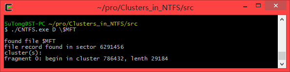
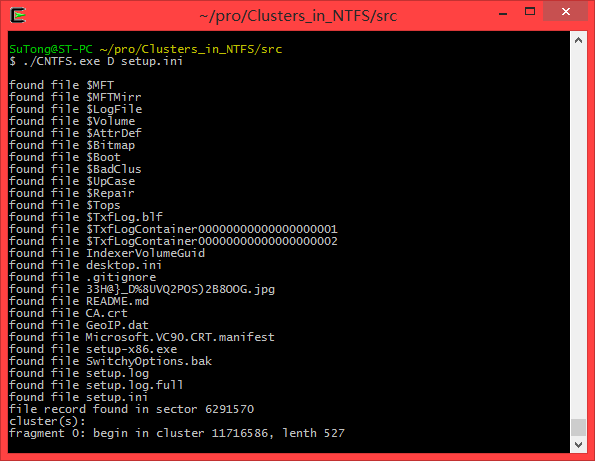

# Get File Clusters in NTFS
	
Get file record from file name and resolve cluster segments

## Developer Dependencies

*   windows xp/7/8

## Usage

`CNTFS.exe <logicDriverName> <filename>`

## cautions

*   `filename` is a file's name but not a file's path and name

*   administrator privilege may needed